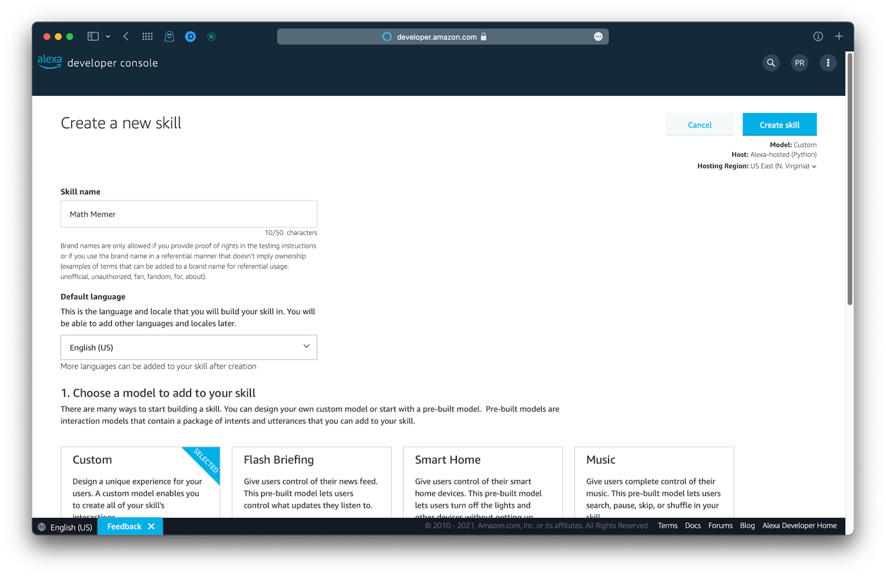
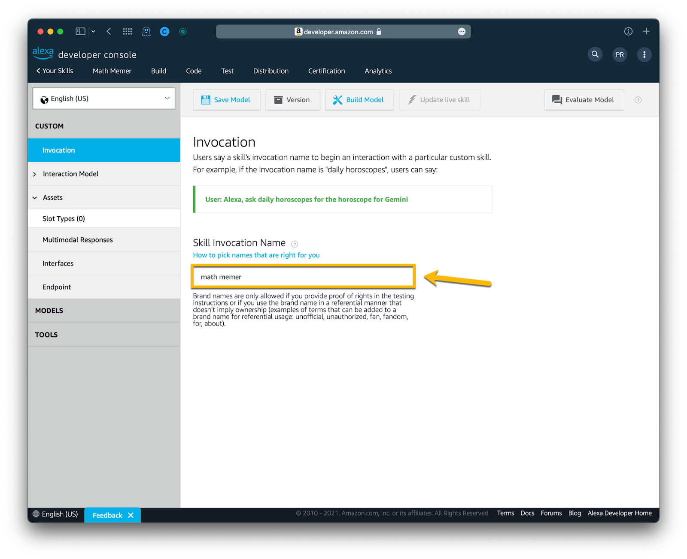
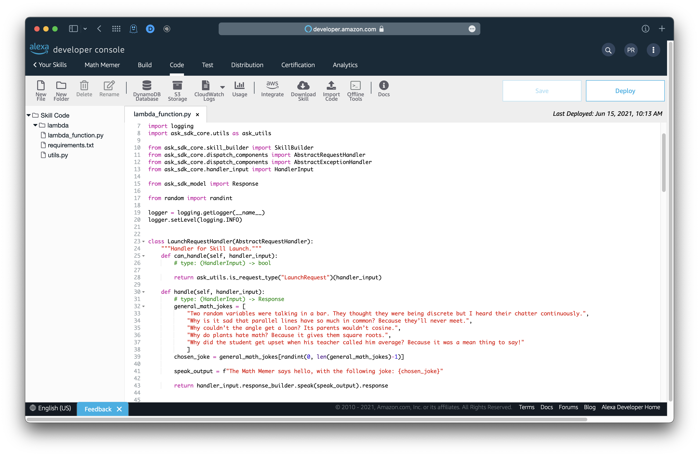
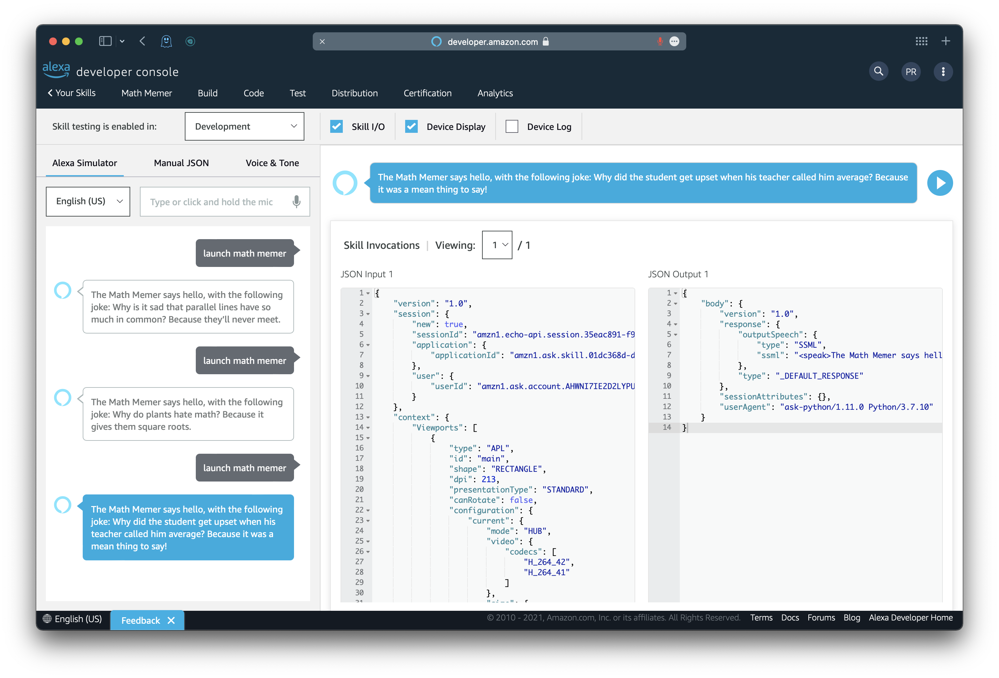

# Math Memer - Invocation Example

*Pranav Ramesh*

## Introduction

We will design a **Math Memer** skill where Alexa will respond to a user’s invocation and produce a math meme. To begin, create a new skill, “Math Memer”.

- Use a **custom** model.
- Make sure to select **Alexa-hosted (Python)** as your hosting method.
- Choose the **Start from Scratch** template.



## Set the invocation name

Once you are on the landing page for your skill, select **Invocation** in the sidebar. Under **Skill Invocation Name**, change the invocation to "math memer". This will be how you tell Alexa that you want to run this skill. Then, click **Save Model**. This will save your progress. Finally, click **Build Model**. This will ensure that Alexa is up to date on how it should respond to the given invocation.



## Changing the code

We will now modify our code so that when we invoke our skill, Alexa will automatically read a math joke from a predefined list of jokes.

To start, click the **Code** tab on the top of the page. Under the `import` statements, add the following:

```python
from random import randint
```

This will allow us to randomly select a joke from our list of jokes. Next, we will add code to the `LaunchRequestHandler` class. When our skill initially launches, this class is the first one whose functions are executed. The other classes that we include later on would be those for the different intents that we can use.

In the `LaunchRequestHandler` class, update the `handle()` function in the following manner:

```python
class LaunchRequestHandler(AbstractRequestHandler):
    # Some code not shown
    def handle(self, handler_input):
        # type: (HandlerInput) -> Response
        general_math_jokes = [
            "Two random variables were talking in a bar. They thought they were being discrete but I heard their chatter continuously.",
            "Why is it sad that parallel lines have so much in common? Because they’ll never meet.",
            "Why couldn’t the angle get a loan? Its parents wouldn’t cosine.",
            "Why do plants hate math? Because it gives them square roots.",
            "Why did the student get upset when his teacher called him average? Because it was a mean thing to say!"
            ]
        chosen_joke = general_math_jokes[randint(0, len(general_math_jokes)-1)]

        speak_output = f"The Math Memer says hello, with the following joke: {chosen_joke}"

        return handler_input.response_builder.speak(speak_output).response
```

Let's break this function down.

- The `handle()` function will be called after we invocate the skill using `open math memer`, `launch math memer`, etc. We haven't given any input to `handle()`, so we don't need to worry about the `handler_input` parameter for now.
- We write the `# type` comment as a reminder to Python and the user that we take in a `HandlerInput` object as input and return a `Response` object.
- `general_math_jokes` is a list containing a few jokes (these can be any math jokes you like) as strings.
- `chosen_joke` is a randomly chosen joke from `general_math_jokes`. We get a random joke using the `randint` function with `0` and `len(general_math_jokes)-1` as the two (inclusive) bounds.
- `speak_output` is what Alexa will say back to the user.
- We return `speak_output` using the `speak()` function from `response_builder` and `handler_input` through dot notation.

The reason we excluded `ask()` after `speak()` was that for the purposes of this exercise, after we launch our skill with our invocation, we aren't going to interact with the skill anymore; hence, Alexa doesn't need to ask us for a response to the joke

Once you've modified the `LaunchRequestHandler` class, you should end up with the following code.



You can save and deploy your code now.

## Testing the skill

Currently, we have set up an invocation for Alexa to associate with our program, so that when we utter this invocation, our skill will launch. Additionally, we've added the code functionality to handle the event that our skill is launched.

Before we proceed to test our skill, ensure that you have **built** your model and **deployed** your code. After that, click the **Test** tab on the top of the page. In the dropdown next to "Skill testing is enabled in", select **Development**. This will allow us to converse with Alexa.

To invoke your skill, in the text box, type or say any of the following:

- "open math memer"
- "launch math memer"
- "math memer"

If Alexa tells you that it had trouble with the request, type/say "quit" and repeat the invocation again.



**Congratulations! You've created a successful skill that produes a math joke when invoked!**